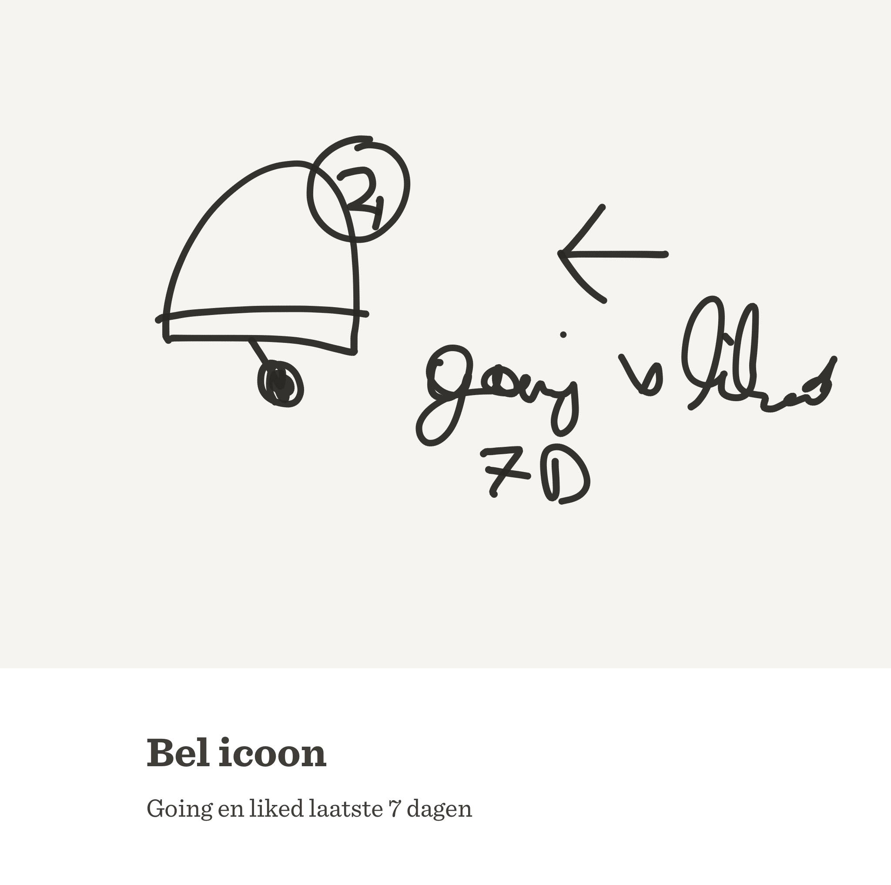
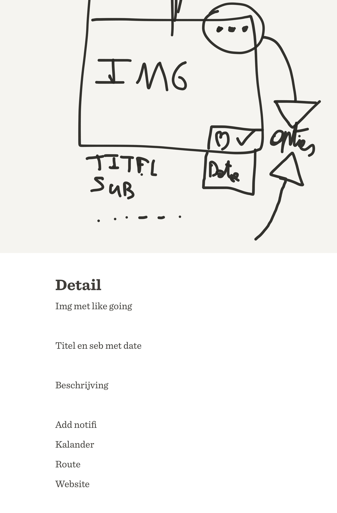
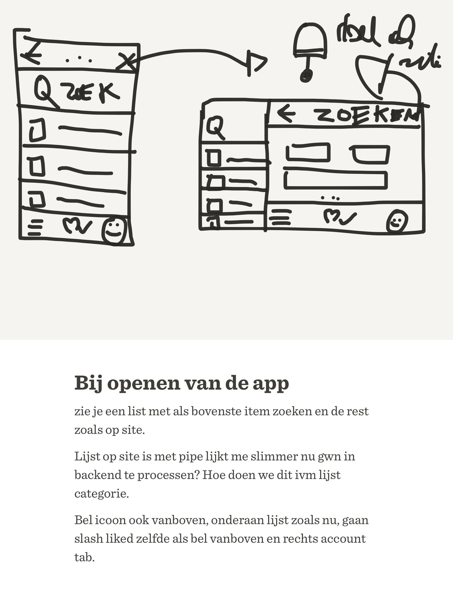
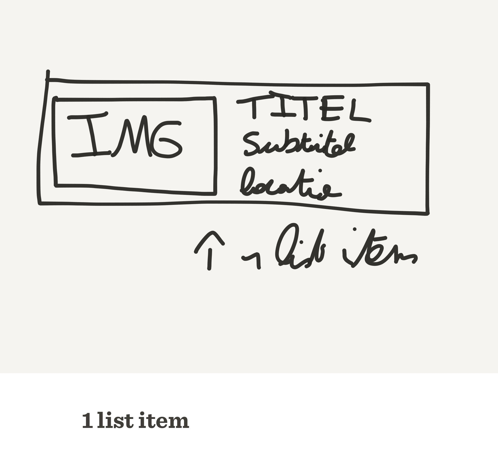
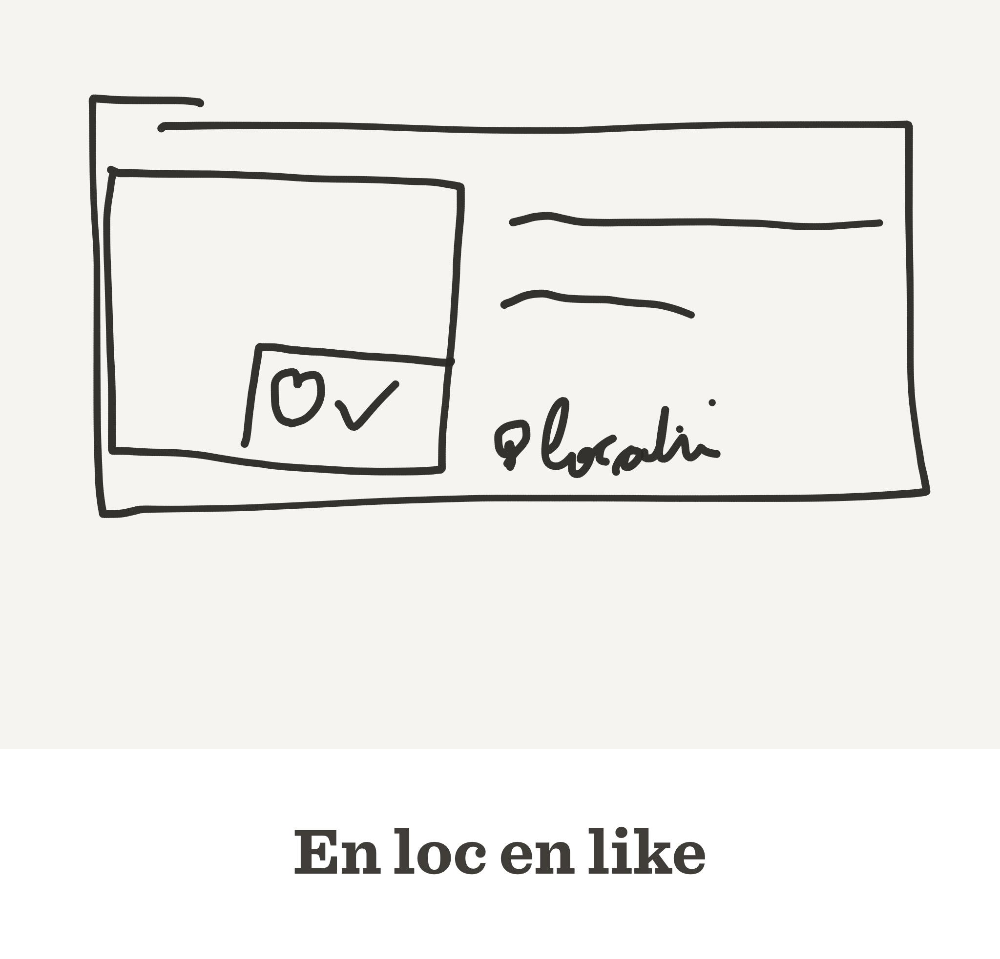
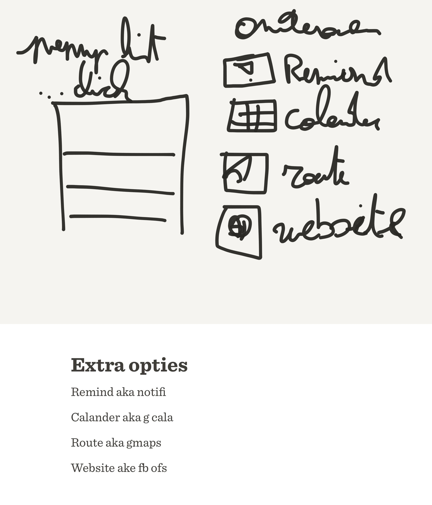
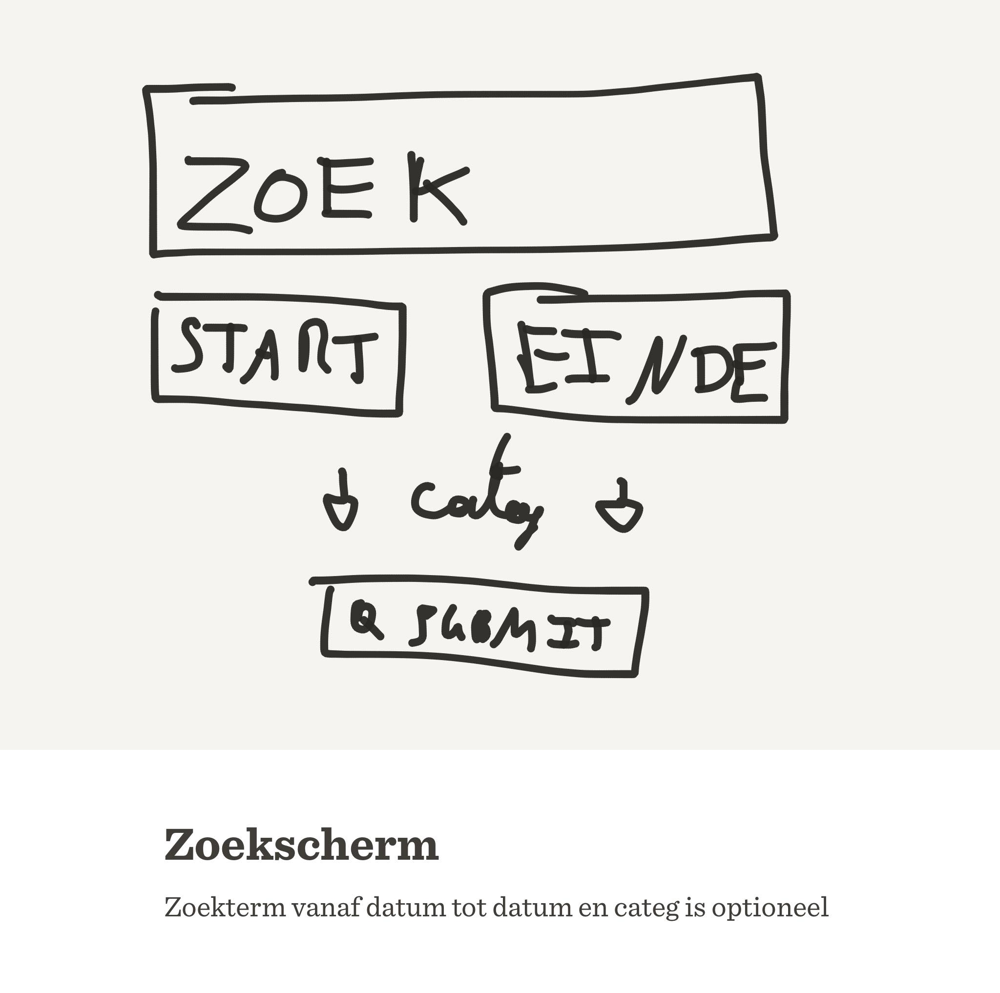

# Feature 1: Basic GUI van home (meetinglijst) en de detailpagina (één meeting)

Een goed idee van hoe de GUI er zal uitzien is het begin van een goede app. Daarom stak ik ook enige tijd in [het uittekenen van shetsen](#brainstormsessie-schetsen) en het neerpennen hoe deze schermen er juist zullen uitzien.

## Inhoudsopgave

> - [Universeel:](#universeel-)
>     - [De App Bar](#de-app-bar)
>     - [Bottom Navigation Bar](#bottom-navigation-bar)
> - [Home:](#home-)
>     - [De lijst](#de-lijst)
>     - [Zoeken](#zoeken)
> - [Detail](#detail)
>     - [Header](#header)
>     - [Content](#content)
>     - [Footer (More options)](#footer--more-options-)
> - [Brainstormsessie schetsen](#brainstormsessie-schetsen)
>     - [Bel icoon](#bel-icoon)
>     - [Detailscherm](#detailscherm)
>     - [Homelijst](#homelijst)
>     - [Lijstitem v1](#lijstitem-v1)
>     - [Lijstitem v2](#lijstitem-v2)
>     - [Optiesmenu](#optiesmenu)
>     - [Zoekscherm](#zoekscherm)

## Universeel:

### De App Bar

- Links staat de back toets waar iedereen hem verwacht
- In het midden staat de titel van de huidige view
- Rechts staat en zoek icoontje dat naar zoeken gaat en een bel icoontje met een nrtje bij van hoeveel events er deze week zijn dat de gebruiker "geliked" heeft of "going" heeft gekozen

### Bottom Navigation Bar

- Links staat het lijst icoontje en verwijst naar de lijst waarnaar de app boot
- In het midden staat het hartje en vinkje icoon waarmee je naar je gelikete en going meetings gaat
- Rechts staat je profiel icoontje dat je naar je profiel settings neemt om oa je voorkeuren te wijzigen. 

## Home:

Het scherm waar je origineel naar opent zal een lijst zijn van alle meetings startende vanaf en inclusief vandaag. Ook zal er al een app bar moeten zijn en een navigation menu onderaan. Bij een groter scherm zal deze lijst op de linkerhelft van het scherm komen te staan en de detailpagina op de rechterhelft. Het default geselecteerde item is dan het eerste item van de lijst namelijk "zoeken".

### De lijst

- De lijst is een fragment met een recycler listview, "rage against the app" zal hiervoor een grote bron zijn.
- Initieel is de lijst van meetings vanaf vandaag ingeladen en op datum gesorteerd. De layout is als volgt:
    - Toon de img links met in de rechteronderhoek liked en going icoon en amount
    - Naast de image staat de titel en daaronder de korte subtitel
    - Onder de titel staat de locatie zijnde een marker icoontje met daarnaast de gemeente

    
### Zoeken

Het eerste list item is een zoek icoon met rechts daarvan Zoeken in het groot zodat dit zeker opvalt. Via dit list item (dat default geselecteerd is op grotere schermen) of via de zoek knop in de App Bar zal je de lijst van meetings kunnen filteren.

## Detail 

Dit scherm zal dienen om 1 speciefieke meeting weer te geven nadat deze geselecteerd is via de lijst (op home of van gelikete/going meetings). Afhankelijk van de schermgrootte zal dit op op het rechterdeel van het scherm komen of het volledige scherm in beslag nemen.

### Header

De bovenzijde van de detailpagina zal de image zijn die bij de meeting hoort met in de rechteronderhoek de liked en going knoppen/amount.

### Content

Links onder de meeting image zal de titel staan met de subtitel. Rechts onder de image (in het verlengde van de liked going amount) zal de datum staan in korte notatie. rechtsboven in de image staan 3 bolletjes, het gekende More options icoon, dat als popup dezelfde lijst opties geeft als de [footer](#footer) voorziet.

Onder dat alles staat de lange tekst van de meeting.

### Footer (More options)

Onderaan de detailpagina zal je knoppen vinden met dezelfde functionaliteit van het more options menu, namelijk:

- zet een reminder (geef notificatie x uur voor meeting start)
- voeg toe aan kalender (open kalenderapp)
- geef routebeschrijving (open navigatieapp)
- open website indien er een website aan meetings is toegekend (open browserapp)

## Brainstormsessie schetsen

### Bel icoon

### Detailscherm

### Homelijst

### Lijstitem v1

### Lijstitem v2

### Optiesmenu

### Zoekscherm

